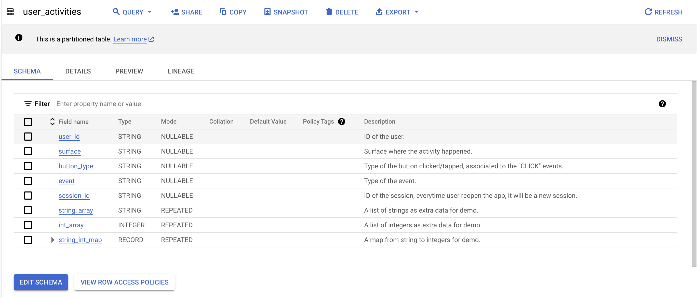
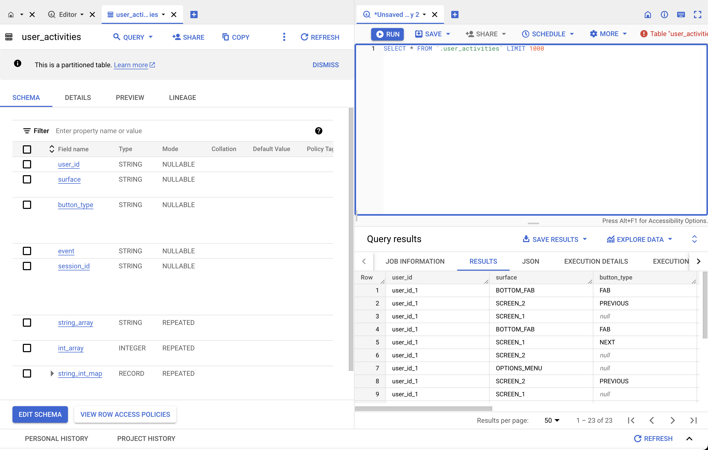

# Example

Here is a end to end example of logging events to bigquery from your Android / iOS and node apps. We'll cover

- Defining LogUnify schema
- Generating iOS / Android / Node client logging library from the definned schema
- Deploying event ingestion service and connecting it to BigQuery
- Writing events to BigQuery from your client App

In the example, we want to log user click events, the button they clicked, as well as the surface of the button.

## Schema Definition

The first step is to define your events schema. In this example we create a schema called `user_activity.yml` and with the content below and put it under a
folder called `schemas`. This schema will be used by LogUnify codegen tool to generate client SDK and the events ingestion service for bigquery integration.

```yaml
projectName: TestProject
schema:
  name: UserActivity
  description: Table for user activity.
  enums:
    - name: Event
      values:
        - IMPRESSION
        - CLICK
    - name: Surface
      values:
        - SCREEN_1
        - SCREEN_2
        - TOP_NAV
        - OPTIONS_MENU
        - BOTTOM_FAB
    - name: ButtonType
      values:
        - NEXT
        - PREVIOUS
        - FAB
        - OPTIONS
        - SETTINGS
  fields:
    - name: userId
      type: string
      description: ID of the user.
    - name: surface
      type: enum<Surface>
      description: Surface where the activity happened.
    - name: buttonType
      type: enum<ButtonType>
      description: Type of the button clicked/tapped, associated to the "CLICK" events.
    - name: event
      type: enum<Event>
      description: Type of the event.
    - name: sessionId
      type: string
      description: ID of the session, everytime user reopen the app, it will be a new session.
    - name: stringArray
      type: array<string>
      description: A list of strings as extra data for demo.
    - name: intArray
      type: array<int32>
      description: A list of integers as extra data for demo.
    - name: stringIntMap
      type: map<string, int32>
      description: A map from string to integers for demo.

outputs:
  - name: BQ
    type: BigQuery
    gcpProject: [ replace_with_your_project ]
    dataset: [ replace_with_your_dataset ]
    table: [ replace_with_your_table ]
    key: [ replace_with_your_service_account_key ]
```

* To learn more about the schema syntax, please read [Schema Definition](/schema_definition) doc.

## Start LogUnify Service

1. Clone the codegen repo `git clone https://github.com/logunify/logunify`
2. Start service: `logunify/scripts/service.sh -s schemas -c logunify/config/config.properties`

These steps will start the logunify service on port `8081` on your local machine with the default config.

* To learn how to run the logunify service on cloud, please read [deployment](/deployment) doc.
* To learn more about the configuration, please read [Configuration](/configuration) doc.

### Verify the Service is Up

Once service is fully up you should be able to see the following logs:

```
20xx-xx-xx xx:xx:xxx.xxx  INFO 7 --- [main] com.logunify.LogunifyServiceApplication  : Started LogunifyServiceApplication in x.xxx seconds (JVM running for x.xxx)
```

(Optional) Verify the service health:

- Run `curl -X GET localhost:8081/actuator/health/readiness`
- The output should be `{"status":"UP"}`

### Verify the Schema is Loaded

- Enter the following command: `curl -X GET localhost:8081/api/info/schemas`
- The output should be `[TestProject/UserActivity]`
- Goto gcp verify the table has been created. Like the screenshot below:


## SDK Generation

1. Download the source code from `http://localhost:8081/download-source-file/TestProject/UserActivity?language={language}` with the language you want.
    * Currently, we support `java`, `swift` and `type_script`
    * For instance: `curl -X GET "http://localhost:8081/download-source-file/TestProject/UserActivity?language=java" -o UserActivity.java`
2. Copy the generated code into your project folder.

We also provide to run codegen as a standalone utility. Please refer to [codegen](/codegen) for more information about codegen.

## Code Integration

Please read platform specific integration doc regarding logging events from app:

- [iOS](/ios)
- [Android](/android)
- [node](/node)

## Verify the Logged Events in BigQuery:

The events logged should appear in BigQuery in minutes.

